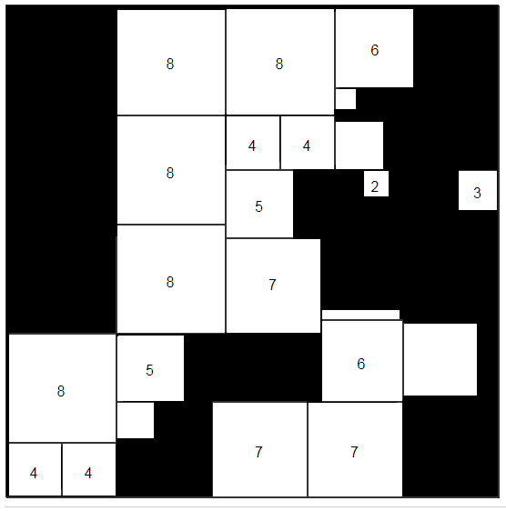

## Overview

This is a web-based solitaire game I'm writing based on Partridge Puzzles, which are squares that are a tiling of smaller squares in a specific distribution: one 1x1 square, two 2x2 squares, and so on up to eight 8x8 squares.  More info on the math behind this is available [here](http://www.mathpuzzle.com/partridge.html).

The player will be presented one of the 18,656 possible squares (8 symmetries each of the 2,332 unique possible squares), completely shrouded at first except for one each of the 2,3,...,8 sub-squares, which start uncovered.  The player's main "move" is to click on any edge of any fully revealed square to "look over the fence", revealing a strip on the other side of the edge.  The game will do the easy deductions for the player, namely when two corners and their connecting edge are revealed, it will uncover the rest of the square automatically.

Through manual and automatic deductions the player will slowly unveil neighbouring areas.  The goal is to explore only as much of the shroud as is necessary to correctly deduce the location of all the other sub-squares.  The more you still have shrouded when you submit a correct solution to the puzzle, the higher your score.  Incorrect deductions will lower your score.  Because the game is finite in its domain, as statistics are gathered there will eventually be a leaderboard type of metric to measure yourself on, similar to the statistics boards in Zachtronics games.

This is probably the most basic, canonical rule-set you can have for this puzzle game, but really the possibilities are endless.  It could eventually morph into a head-to-head turn-based game played against another person, where you have other exotic probe types (other than just clicking an edge) to use on your opponent's board, the goal being to solve their square before they can solve yours.  This is a neat play on the classic game Battleship.  So really there could be a lot more done with this idea.  For now though, the first checkpoint will be a solitaire-only game.

## Roadmap

The roadmap is still new and will evolve over time:

- [x] Buy `squaregame.io`

- [x] Generate the square data, some options:
  - [ ] Parse [Munklar's](https://github.com/Munklar/Partridge-Puzzle) solution outputs
  - [ ] Upgrade my dlx solver to Algorithm M from Knuth's Art of Computer Programming and generate them as an exact cover problem
  - [ ] Generate them from scratch using a hylomorphism. This is underway at [app/Main.hs](./app/Main.hs)
  - [x] Generate them from scratch using C# and an iterative algo

- [ ] Game logic
  - [ ] Auto-deduction of whole tile (sub-square) from two revealed corners and the connecting edge
    - [ ] Unit tests for a couple examples

- [ ] Server-side (in Haskell of course!)
  - [ ] Database design
  - [ ] Learn [Scotty](http://hackage.haskell.org/package/scotty-0.11.3/docs/Web-Scotty.html)
  - [ ] API interface for clients
    - [ ] Log in
    - [ ] Start puzzle
    - [ ] Edge clicked
    - [ ] Request scores/stats

- [ ] Use cases
  - [ ] User registers on site
    - [ ] Twitter auth
    - [ ] Google auth
    - [ ] Facebook auth
    - [ ] Github auth
  - [ ] Player starts new puzzle
    - [ ] At random
    - [ ] That at least one person has already solved (non-blank leaderboard)
  - [ ] Player clicks through puzzle (main gameplay)
  - [ ] Player submits solution attempt
  - [ ] Player browses their past puzzle results/scores

- [ ] Client-side (JavaScript in the browser, preferably via [PureScript](http://www.purescript.org/))
  - [ ] Local client phase
    - [x] Render current puzzle board in a desktop window using [gloss](http://hackage.haskell.org/package/gloss)
    - [x] Render hot-zones for edge clicking during mouseover
    - [x] Randomly deshroud starting board
    - [ ] Take click input and modify board via (coupled) API call
    - [ ] Local filesystem DB for this phase to hold state between requests?
    - [ ] Migrate filesystem DB to [sqlite](https://www.sqlite.org/index.html)
    - [ ] Decouple into separate server/client components
  - [ ] Partridge puzzle React component for rendering in-progress puzzle
    - [ ] Hovering over an edge shows a visual cue selecting that edge for clicking
    - [ ] Render "click-path" through puzzle
  - [ ] Display remaining tiles (the placeable sub-squares)
  - [x] Player drags a tile onto the board

## Concept Art

Here's a mock-up of a game in mid-round (obviously these are default aesthetics and can be spruced up):

